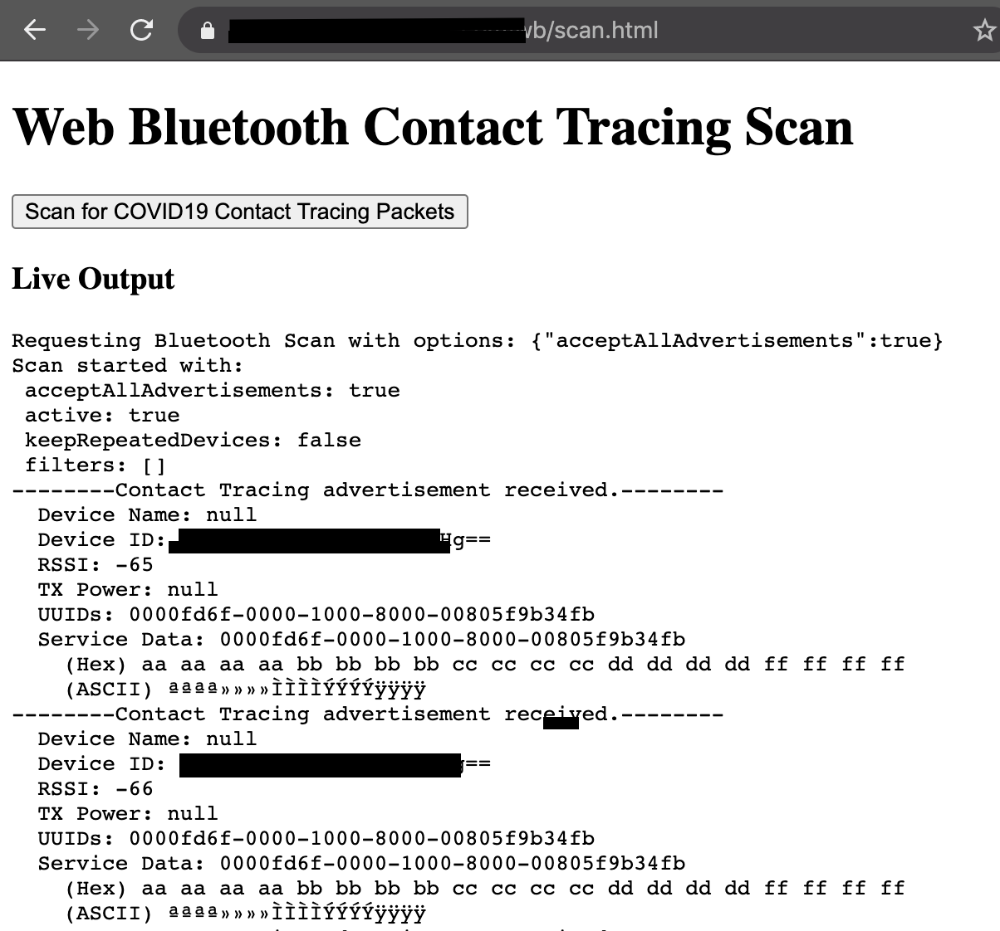
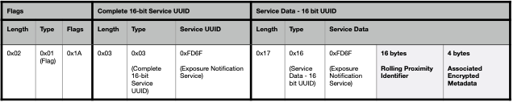
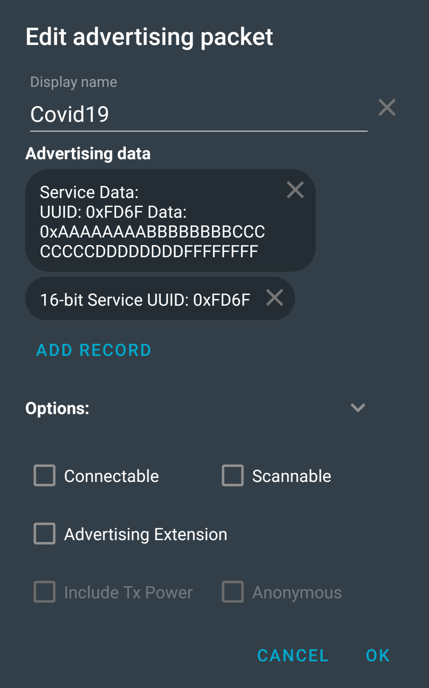

# in_the_air_tonight
a short but sweet COVID19 Contact Tracing BLE packet detector
## what
COVID19 Contact Tracing implemented by google and apple
* https://covid19-static.cdn-apple.com/applications/covid19/current/static/contact-tracing/pdf/ExposureNotification-BluetoothSpecificationv1.2.pdf
* https://blog.google/documents/58/Contact_Tracing_-_Bluetooth_Specification_v1.1_RYGZbKW.pdf
### web bluetooth?! web bluetooth.
Check out scan.html for a cheap hack of the google chrome web bluetooth advertisement scan example code. You too can now scan for Contact Tracing packets via a web page.

||
-

## why
i want to see them! do analysis, find vulnz.
## where
i'm running on a raspberry pi. should work on any linux box with a BT adapter.
## will work?
i don't know. it matches the spec. i haven't seen one in the wild yet

## how run?
run it. it's really simple right now, just 
`sudo python3 in_the_air_tonight.py`
and output will appear on your screen. pip install bluepy, also.
## how test?
use NRF Connect app to add an advertiser with settings like this:

